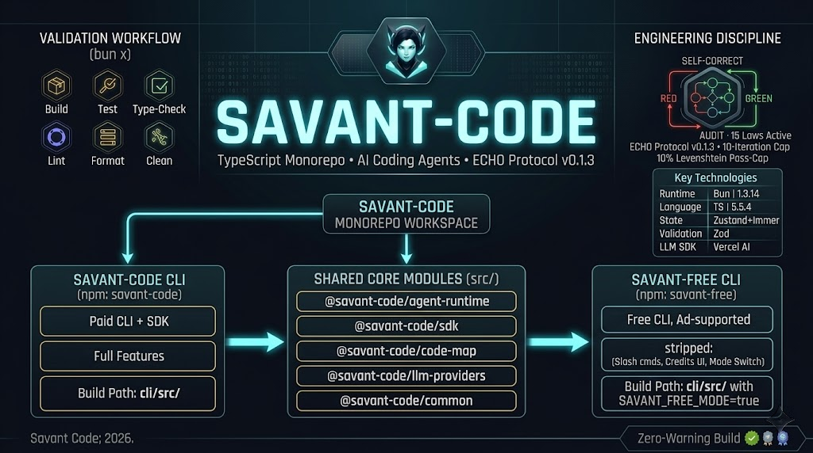

# SAVANT-CODE v0.2.0

<!-- markdownlint-disable MD033 -->
<div align="center">



**Multi-Agent AI Coding Assistant. TypeScript Monorepo. ECHO-Protocol Citizen.**

Two products ship from this monorepo. **Savant-Code** is the full-featured AI coding agent for your terminal — multi-agent orchestration, custom skills, MCP tool discovery, progressive skill loading, custom slash commands, stream-JSON output for CI (now with real agent output via `SavantClient` integration in v0.2), and the [`@savant-code/sdk`](https://www.npmjs.com/package/@savant-code/sdk) for embedding agents in your own apps. **Savant-Free** is the free, ad-supported variant — no subscription, no API key, same agent runtime with paid features stripped at compile time via `SAVANT_FREE_MODE=true`.

[](https://www.typescriptlang.org/)[](https://bun.sh/)[](https://react.dev/)[](https://github.com/sst/opentui)[](protocol/ECHO.md)[](LICENSE)[](https://github.com/fame0528/savant-code/releases/tag/v0.0.1)

</div>

---

## Overview

Savant-Code is a TypeScript monorepo that builds, ships, and maintains two AI coding-agent products from one workspace:

- **Savant-Code** (npm: [`savant-code`](https://www.npmjs.com/package/savant-code)) — the paid CLI + the public [`@savant-code/sdk`](https://www.npmjs.com/package/@savant-code/sdk). Multi-agent orchestration, custom skills, MCP tool discovery, OAuth + API-key auth, mode switching (`FREE` / `MAX` / `PLAN`), usage metering.
- **Savant-Free** (npm: [`savant-free`](https://www.npmjs.com/package/savant-free)) — the free, ad-supported CLI. Same agent runtime, same SDK, but built with `SAVANT_FREE_MODE=true` so the bundler strips paid-only slash commands, credits UI, and mode switching. Result: a single binary that "just works" — no subscription, no API key, no config.

Both products are built from the same `cli/` source — only the build flag differs. The SDK, the agent runtime, the multi-agent orchestration engine, the tool layer, and the LLM provider shims are shared. That's why two products can ship from one monorepo without duplicating thousands of lines.

The whole project ships under [ECHO Protocol v0.1.3](protocol/ECHO.md) — the same 15-law agent discipline that governs [`savant-trading`](https://github.com/fame0528/savant-trading) and [`savant-bot`](https://github.com/fame0528/savant-bot). Every change goes through the RED → GREEN → AUDIT → SELF-CORRECT → COMPLETE Perfection Loop FSM, with a hard 10-iteration cap and a 10% Levenshtein change-cap per pass.

---

## Key Technologies

| Layer | Tech | Version |
|-------|------|---------|
| Runtime | Bun | 1.3.14 (engines `>=1.3.11`) |
| Language | TypeScript | 5.5.4 (`strict: true`, `noImplicitReturns: true`) |
| TUI | OpenTUI + React 19 | `@opentui/core` 0.2.2, `react` ^19.0.0 |
| State | Zustand + Immer | zustand ^5.0.8, immer ^10.1.3 |
| Validation | Zod | ^4.2.1 |
| LLM SDK | Vercel AI SDK | `ai` ^5.0.52 + `@ai-sdk/anthropic` 2.0.50 |
| MCP | Model Context Protocol | `@modelcontextprotocol/sdk` ^1.18.2 |
| Code parsing | tree-sitter (WASM) | `@vscode/tree-sitter-wasm` 0.1.4 |
| HTTP / WS | ws, node-fetch, custom SDK client | ws ^8.18.0 |
| Package manager | Bun workspaces (hoisted) | `bunfig.toml` `[install] linker = "hoisted"` |

---

## Features

### CLI (`@savant-code/cli` — npm: `savant-code`, npm: `savant-free`)

- **Multi-agent orchestration** — specialized agents coordinate via a hand-off protocol: a File Picker scans the repo, a Planner sequences edits, an Editor makes precise diffs, and a Reviewer validates them.
- **`/init` command** — scaffolds `.agents/types/{agent-definition,tools,util-types}.ts` and a starter `knowledge.md`. The TypeScript generators give programmatic control over hand-offs, tool selection, and prompt construction.
- **Slash commands** — `/new`, `/history`, `/bash`, `/feedback`, `/theme:toggle`, `/login`, `/logout`, `/exit`, plus agent-specific commands. See [`cli/src/data/slash-commands.ts`](cli/src/data/slash-commands.ts) for the canonical registry.
- **`@filename` and `@AgentName` mentions** — file and agent mentions with inline autocomplete.
- **Bash mode** — `!command` or `/bash` to run shell commands inline (with confirmation).
- **OAuth + API-key auth** — login flows for ChatGPT Plus/Pro (OAuth), Savant-Code API keys, and guest mode (savant-free).
- **Mode switching** — `FREE` / `MAX` / `PLAN` modes, togglable at runtime via UI; only `FREE` in savant-free builds (compile-time flag).
- **Streaming & cancellation** — token-by-token SSE streaming with mid-stream cancellation, retry-with-backoff, and subagent streaming for parallel work.
- **Knowledge files** — project-level `knowledge.md` plus per-user home-dir knowledge, auto-loaded into agent context.
- **Skills** — OpenClaw-format `SKILL.md` files discovered at startup, schemas sent to the LLM, available as native tools.
- **MCP tools** — Model Context Protocol servers discovered at startup, schemas published to the LLM API.
- **Local agent registry** — load custom `.agents/` agents from any project directory.
- **Theming** — light/dark toggle (`/theme:toggle`), per-agent color palettes.

### SDK (`@savant-code/sdk`)

- **`SavantClient` class** — single entry point for running agents from any Node.js / Bun / browser app.
- **Streaming events** — `handleEvent` callback receives `RunState` updates, tool calls, file diffs, and final output.
- **Custom agents** — pass `agentDefinitions: AgentDefinition[]` to override defaults.
- **Custom tools** — pass `customToolDefinitions` to extend the tool registry.
- **Cancellation** — `AbortSignal` propagates through subagent streams.
- **Three module formats** — `dist/index.cjs` (require), `dist/index.mjs` (import), `dist/index.d.ts` (types).
- **Pure types** — `sideEffects: false`, tree-shakeable.
- **Stream-JSON event schema** (v0.1) — `StreamJsonEmitter` + `StreamEvent` types for non-interactive agent runs. Emit `session.start` / `message.user` / `message.assistant` (chunked) / `message.assistant.done` / `tool.call` / `tool.result` / `error` / `session.end` to any `Writable` stream.

### Agent Runtime (`@savant-code/agent-runtime`)

- **LLM-agnostic** — calls any provider registered with `@savant-code/llm-providers` (OpenAI-compatible chat, Anthropic, etc.).
- **Multi-step loop** — model decides tool → tool executes → result fed back → repeat until `end_turn` or budget exhausted.
- **Tool registry** — built-in (`read_files`, `write_file`, `run_terminal_command`, `code_search`, `web_search`, `spawn_agents_inline`, …) + custom + MCP.
- **Cost aggregation** — per-call token counts and USD cost estimates surfaced in `RunState`.
- **Prompt caching** — subagent caching for repeated context blocks.
- **Propose-tools** — model proposes new tools at runtime; user approves; tool registry is mutable.

### Code-Map (`@savant-code/code-map`)

- **tree-sitter-based** parser for fast incremental indexing of TS/TSX/JS/JSX.
- **Per-file language detection** and per-symbol scoping.
- **Used by `code_search` tool** to keep search latency under 200ms on 100K+ line repos.

### LLM Providers (`@savant-code/llm-providers`)

- **OpenAI-compatible chat** shim — drop-in for any provider that speaks the OpenAI Chat Completions API.
- **Streaming + non-streaming** paths.
- **Provider-options metadata** — passthrough for vendor-specific features (Anthropic prompt caching, OpenAI reasoning, etc.).

### Common (`@savant-code/common`)

- **Shared types** — `AgentDefinition`, `RunState`, `ToolDefinition`, `Message`, `ChatMessage`.
- **Shared tools** — `read_files`, `write_file`, `code_search`, etc., consumed by both CLI and SDK.
- **Shared utilities** — `analytics-dispatcher`, `rate-limit`, `partial-json-delta`, `saxy`, `messages`, `string`, `zoned-time`.

### Evaluations (`@savant-code/evals`)

- **Buffbench** — Savant-Code's public benchmark subset (the larger internal benchmark is not open-sourced).
- **Multi-repo tasks** — coding tasks over multiple open-source repos that simulate real-world edits.
- **Scoring** — binary pass/fail + rubric scoring per task, aggregated per model.

### Engineering Discipline (ECHO Protocol v0.1.3)

- **15 Laws active** — 4 immutable process (Read 0-EOF, Present Before Act, Verify Before Proceed, Call-Graph Reachability) + 11 extended code laws.
- **`strict: true`** — TypeScript strict mode is non-negotiable. Zero `any`, `@ts-ignore`, `@ts-expect-error` in production code (test fixtures may use `as any` casts where necessary — currently ~900 occurrences in test code, zero in production code).
- **TypeScript coding standard** — `max_file_lines: 400`, `max_function_lines: 60`, `max_line_length: 100` (overrides the ECHO defaults of 300 / 50 / 100).
- **6 validation commands** — `bun run build:sdk && bun run build:savant-free` (build), `bun test` (test), `bun x tsc --noEmit -p tsconfig.json` (type_check), `bun x eslint . --max-warnings 0` (lint), `bun x prettier --write .` (format), clean (clean). All 6 are wired into `protocol/protocol.config.yaml`.
- **FID lifecycle** — bugs, anti-patterns, security concerns, and improvements tracked via `dev/fids/` with auto-archive on closure.
- **Honest Assessment** — every status claim is backed by tool output, never self-reporting.

---

## Repo Map

| Workspace | Package | Purpose |
|-----------|---------|---------|
| `agents/` | `@savant-code/agents` | Public agent definitions shipped with the CLI (base, base2, thinker, editor, basher, context-pruner, librarian, file-picker, browser-use, e2e fixtures) |
| `cli/` | `@savant-code/cli` | The CLI source — UI, commands, state, hooks, OpenTUI/React components. `bin/savant-code` (paid) is built from here |
| `common/` | `@savant-code/common` | Shared types, tool definitions, utilities, analytics, error helpers |
| `evals/` | `@savant-code/evals` | Buffbench benchmark runner + public eval fixtures |
| `free-build/` | `@savant-code/savant-free` | The savant-free product layer — `cli/build.ts` (sets `SAVANT_FREE_MODE=true`), release packaging, e2e tests, SPEC.md |
| `packages/agent-runtime/` | `@savant-code/agent-runtime` | The agent loop, tool executor, LLM API integration, subagent streaming |
| `packages/code-map/` | `@savant-code/code-map` | tree-sitter code indexing, language detection |
| `packages/llm-providers/` | `@savant-code/llm-providers` | Public LLM provider shims (OpenAI-compatible chat) |
| `scripts/tmux/` | `@savant-code/tmux-scripts` | tmux helpers for interactive CLI testing |
| `sdk/` | `@savant-code/sdk` | The public SDK — `SavantClient`, types, build + verify scripts |

Top-level directories:

```text
savant-code/
├── agents/                 # Public agent definitions
├── assets/                 # Banner / diagram images
├── cli/                    # CLI source (paid + free)
│   ├── src/                # OpenTUI/React UI, commands, state
│   ├── scripts/            # Build + release scripts
│   ├── release/            # Prebuilt npm release (paid) — codebuff shim
│   └── release-staging/    # Prebuilt npm release (staging) — codecane shim
├── common/                 # Shared types, tools, utilities
├── docs/                   # Project documentation (agents-and-tools, testing)
├── evals/                  # Buffbench benchmark + fixtures
├── free-build/             # Savant-Free product layer
├── packages/               # Internal packages (agent-runtime, code-map, llm-providers)
├── protocol/               # ECHO Protocol v0.1.3 scaffold (read protocol/README.md)
├── sdk/                    # Public SDK (@savant-code/sdk)
├── scripts/tmux/           # tmux helpers
├── dev/                    # Runtime state (FIDs, LEARNINGS, session summaries)
├── package.json            # Root workspace config (Bun workspaces, hoisted)
├── tsconfig.json           # Root TS config (extends tsconfig.base.json)
├── tsconfig.base.json      # Shared compiler options (strict, noImplicitReturns)
├── eslint.config.js        # Flat-config ESLint (typescript-eslint, import, unused-imports, prettier)
├── bunfig.toml             # Bun config (hoisted linker, test exclude, env preload)
├── AGENTS.md               # Repo map + conventions
├── README.md               # This file
└── LICENSE                 # Apache-2.0
```

---

## Quick Start

### Prerequisites

- **Bun 1.3.14+** — [bun.sh](https://bun.sh/) (engines field requires `>=1.3.11`)
- **Node.js 18+** — only required if you consume the SDK from a non-Bun app
- No global tools needed; everything runs from the monorepo.

### 1. Clone and Install

```bash
git clone https://github.com/fame0528/savant-code.git
cd savant-code
bun install
```

`bun install` uses the hoisted linker (`bunfig.toml` `[install] linker = "hoisted"`) so workspace dependencies are deduplicated at the root.

### 2. Run the CLI (development)

```bash
# Run the CLI in dev mode (paid: savant-code)
bun run dev

# Or run the savant-free variant (compile-time flag set)
bun run dev:savant-free
```

Both commands launch the CLI pointed at the repo root as the working directory, with hot reload.

### 3. Build for Release

```bash
# Build the SDK (publishable to npm)
bun run build:sdk

# Build the savant-free CLI binary
bun run build:savant-free

# Build both in sequence (matches `protocol.config.yaml → commands.build`)
bun run build:sdk && bun run build:savant-free
```

### 4. Use the SDK

```ts
import { SavantClient } from '@savant-code/sdk'

const client = new SavantClient({
  apiKey: process.env.SAVANT_CODE_API_KEY,
  cwd: '/path/to/your/project',
  onError: (err) => console.error('Savant-Code error:', err.message),
})

const result = await client.run({
  agent: 'base',
  prompt: 'Add error handling to all API endpoints',
  handleEvent: (event) => console.log('Progress', event),
})
```

### 5. Use Savant-Free (end-user)

```bash
npm install -g savant-free
cd ~/my-project
savant-free
```

### 6. Use Savant-Code (end-user)

```bash
npm install -g savant-code
cd ~/my-project
savant-code
```

### 7. Use in CI / scripts (stream-JSON, v0.1+)

```bash
# Auto-detected when stdout is not a TTY
savant-code "fix the failing tests" | jq -c 'select(.type | IN("message.assistant.done", "session.end"))'

# Or be explicit
savant-code --output-format stream-json "refactor the auth module" > session.ndjson 2> diagnostics.log
```

Exit code: `0` on success, `1` on error or cancellation. One JSON object per line, versioned with `v: 1`. See [protocol/CHANGELOG.md](protocol/CHANGELOG.md) for the event schema.

### 8. Define a custom slash command (v0.1+)

```text
.savant/commands/
  review.md          → /review
  pr.md              → /pr
```

Each `.md` file has optional YAML frontmatter and a body template:

```markdown
---
description: Review code changes with focus on a specific area
aliases: [rev]
argument-hint: "<area>"
---

Please review the recent changes with focus on $1. Use $@ for the full context.
```

Placeholders (per opencode convention): `$1`–`$N` (positional, shell-quoted), `$ARG` / `$@` (entire args), `$SELECTION` (editor selection). Built-in commands always win on collision. Strict mode (`SAVANT_CODE_STRICT_COMMANDS=1` + `~/.savant/allowlist.json`) gates which custom commands are allowed to load.

---

## CLI Commands

Root `package.json` scripts (also see each workspace's own scripts):

| Command | What it does |
|---------|--------------|
| `bun run start-cli` | `bun --cwd cli dev` — launch the CLI in dev mode |
| `bun run dev` | Same as `start-cli` |
| `bun run dev:savant-free` | Launch the CLI with `SAVANT_FREE_MODE=true` |
| `bun run build:sdk` | Build the SDK for npm publish |
| `bun run build:savant-free` | Build the savant-free CLI binary |
| `bun run release:cli` | `bun run --cwd=cli release` — full CLI release flow |
| `bun run release:sdk` | `bun run --cwd=sdk release` — full SDK release flow |
| `bun run release:savant-free` | `bun run --cwd=free-build release` — full savant-free release flow |
| `bun run buffbench` | Run the buffbench eval (`bun --cwd evals run-buffbench`) |
| `bun run ci` | `build:sdk && build:savant-free` — CI gate |

Per-workspace scripts (run from workspace dir, or via `bun --cwd <workspace> <script>`):

- `cli/`: `dev`, `prebuild:agents`, `build:binary`, `release`, `test`, `test:tmux-poc`, `typecheck`
- `sdk/`: `build`, `clean`, `typecheck`, `test`, `test:e2e`, `test:integration`, `verify`, `verify:skip-build`, `smoke-test:dist`, `prepare-dist`, `release`, `fetch-ripgrep`, `prepack`, `dev`
- `common/`: `typecheck`, `test`
- `agents/`: `typecheck`, `test`, `test:e2e`
- `free-build/`: `release`, `build:binary`, `e2e`, `e2e:version`, `e2e:startup`, `e2e:help`, `e2e:slash-commands`, `e2e:mode`, `e2e:ads`, `e2e:agent`, `e2e:code-edit`, `e2e:terminal-command`, `e2e:knowledge-file`
- `packages/agent-runtime/`: `typecheck`, `test`
- `packages/code-map/`: `typecheck`, `test`
- `packages/llm-providers/`: `typecheck`, `test`
- `evals/`: `typecheck`, `run-buffbench`

---

## Configuration

| What | Where | Format |
|------|-------|--------|
| ECHO Protocol runtime config | `protocol/protocol.config.yaml` | YAML — language, commands, quality limits, paths |
| ECHO Protocol agent spec | `dev/ECHO.md` (mirror of `protocol/ECHO.md`) | Markdown — 15 Laws, Perfection Loop, anti-patterns |
| TypeScript base config | `tsconfig.base.json` | JSON — `strict: true`, `noImplicitReturns: true`, `ignoreDeprecations: "6.0"` |
| ESLint config | `eslint.config.js` | Flat config — typescript-eslint, import, unused-imports, prettier |
| Prettier config | `.prettierrc` | JSON — `tabWidth: 2`, `singleQuote: true`, `semi: false` |
| Bun config | `bunfig.toml` | TOML — `linker: "hoisted"`, `linkWorkspacePackages: true`, test exclude |
| Path aliases | `tsconfig.json` → `compilerOptions.paths` | `@savant-code/sdk`, `@savant-code/common/*`, etc. |
| Workspace list | `package.json` → `workspaces` | Bun workspaces (hoisted) |

### ECHO Protocol Quality Limits (per `protocol/protocol.config.yaml`)

| Limit | Value | Source |
|-------|-------|--------|
| `max_file_lines` | 400 | TypeScript override of ECHO default 300 |
| `max_function_lines` | 60 | TypeScript override of ECHO default 50 |
| `max_line_length` | 100 | Matches TS standard |
| `max_complexity` | 10 | ECHO default |
| `max_params` | 4 | ECHO default |
| `max_nesting_depth` | 3 | ECHO default |
| `max_comment_density` | 0.33 | ECHO default |

### ECHO Perfection Loop Circuit Breakers

| Rule | Value | Purpose |
|------|-------|---------|
| Max changes per pass | 10% of file chars | Prevents runaway rewrites |
| 500-char sample verification | exact match | Catches unintended side effects |
| Convergence detection | <2% delta for 2 passes | Stops when stable |
| Oscillation detection | 3× same issue | Escalates to architecture review |
| Hard stop | 10 iterations | Per Perfection Loop |

---

## Validation

All 6 ECHO validation commands (per `protocol/protocol.config.yaml → commands`) — currently run from the repo root:

```bash
# 1. Build (SDK + savant-free binary)
bun run build:sdk && bun run build:savant-free

# 2. Test
bun test

# 3. Type check
bun x tsc --noEmit -p tsconfig.json

# 4. Lint
bun x eslint . --max-warnings 0

# 5. Format
bun x prettier --write .

# 6. Clean
rm -rf dist tsconfig.tsbuildinfo && find . -name node_modules -prune -o -name '*.tsbuildinfo' -print -delete
```

**Current state** (v0.0.1 base): all 6 wired; type_check and lint require `bun install` first to populate `node_modules`. Test count: **197 test files** across `agents/`, `cli/`, `common/`, `free-build/`, `packages/agent-runtime`, `packages/code-map`, `packages/llm-providers`, `sdk/`.

---

## Conventions

From [`AGENTS.md`](AGENTS.md):

- Use **`bun install`** and **`bun run`** — never `npm` or `yarn`.
- Prefer **dependency injection** over module mocking. Tests inject fixtures via constructor params.
- Run **interactive CLI tests in tmux** — `scripts/tmux/` provides helpers.
- **Do not force-push `main`** — use a feature branch + PR.

From the ECHO Protocol (`protocol/coding-standards/typescript.md`):

- **No `any`** in production code; `unknown` + type guards instead.
- **No `@ts-ignore`/`@ts-expect-error`** without justification comment (currently 3 justified uses in `cli/src/commands/init.ts` for Bun text import attributes).
- **Named exports** only; no default exports.
- **`interface` over `type`** for object shapes; `type` for unions/intersections/branded IDs.
- **One import group per block**: std → external → internal → relative.

---

## ECHO Protocol

This project ships with the [ECHO Protocol v0.1.3](protocol/ECHO.md) scaffolded at `./protocol/` and mirrored at `./dev/ECHO.md`. Key entry points:

- **[protocol/README.md](protocol/README.md)** — scaffold notes (what was customized for savant-code)
- **[protocol/ECHO.md](protocol/ECHO.md)** — the single source of truth for agent behavior
- **[protocol/protocol.config.yaml](protocol/protocol.config.yaml)** — `language: typescript`, all 6 validation commands wired
- **[protocol/coding-standards/typescript.md](protocol/coding-standards/typescript.md)** — TypeScript naming, patterns, quality overrides
- **[protocol/templates/FID-TEMPLATE.md](protocol/templates/FID-TEMPLATE.md)** — Feature Implementation Document template
- **[protocol/templates/SESSION-SUMMARY.md](protocol/templates/SESSION-SUMMARY.md)** — Session summary template
- **[dev/LEARNINGS.md](dev/LEARNINGS.md)** — cross-session lessons learned
- **[dev/fids/](dev/fids/)** — active FIDs (Created → Verified lifecycle)
- **[dev/session-summaries/](dev/session-summaries/)** — session summaries (YYYY-MM-DD-HHMM format)

Runtime state lives at the **repository root** in `./dev/` (not under `protocol/dev/`). `.gitignore` tracks `LEARNINGS.md` and the `.gitkeep` markers; everything else is ephemeral.

---

## Sister Projects

Savant-Code is one product in the [Savant](https://github.com/fame0528/Savant) family:

- **[Savant](https://github.com/fame0528/Savant)** — the brand and core project (Rust-native multi-agent swarm, hybrid memory, soul/personality, 25 channel integrations)
- **[Savant-Trading](https://github.com/fame0528/savant-trading)** — autonomous DEX trading on Arbitrum (Rust, 0x API, OpenRouter LLM)
- **[Savant-Bot](https://github.com/fame0528/savant-bot)** — Discord bot interface to Savant (Rust, Poise, SQLite, OpenRouter)
- **[Savant-Protocol](https://github.com/fame0528/savant-protocol)** — the ECHO Protocol itself (MIT, language-agnostic agent discipline)

---

## Documentation

- **[docs/agents-and-tools.md](docs/agents-and-tools.md)** — how to author agents and tools
- **[docs/testing.md](docs/testing.md)** — testing strategy and conventions
- **[free-build/SPEC.md](free-build/SPEC.md)** — full specification of the savant-free build-time flag
- **[sdk/README.md](sdk/README.md)** — SDK usage and examples
- **[WINDOWS.md](WINDOWS.md)** — Windows-specific install and tmux setup
- **[CONTRIBUTING.md](CONTRIBUTING.md)** — contribution guide
- **[SECURITY.md](SECURITY.md)** — security policy

---

## License

[Apache-2.0](LICENSE) — see [LICENSE](LICENSE) for full text.

The ECHO Protocol scaffold (`protocol/`) is MIT-licensed (see [protocol/LICENSE](protocol/LICENSE)) and inherited from [Savant-Protocol](https://github.com/fame0528/savant-protocol).

---

<div align="center">

_Savant-Code is the public TypeScript monorepo for the Savant-Code agent framework. Savant-Free is the ad-supported variant. Both share one runtime, one SDK, and one set of engineering laws (ECHO)._

**Savant** &bull; 2026

</div>
