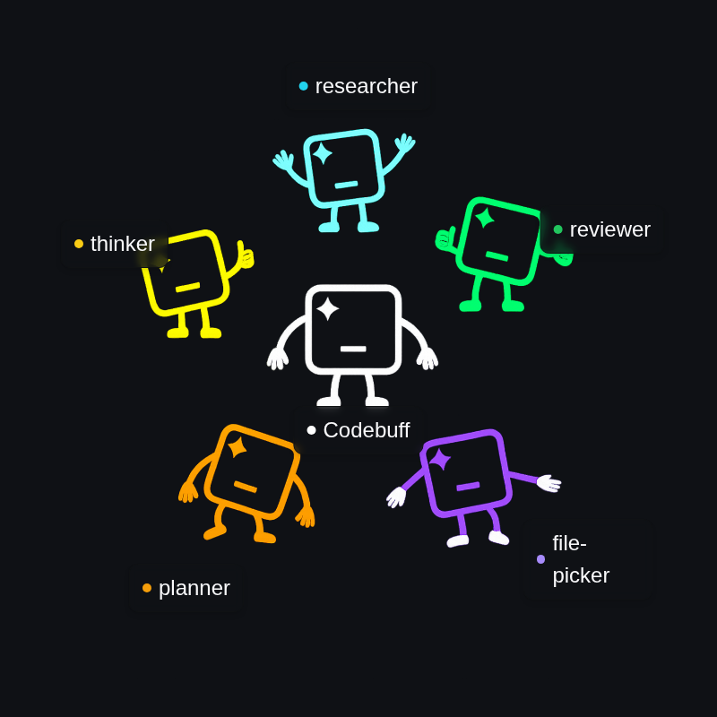

# Savant-Code & Savant-Free

[English](./README.md) | 简体中文

**[Savant-Code](https://savant-code.dev)** 是一款开源的 AI 编程助手，能根据自然语言指令直接修改你的代码库。**[Savant-Free](https://www.npmjs.com/package/savant-free)** 是它的免费、广告支持版本——无需订阅、无需积分、零配置。

与那种"一个模型干所有事"的工具不同，Savant-Code 会协调多个专业化的智能体（agent）协同工作，理解你的项目并做出精准的改动。

<div align="center">
  
</div>

在我们的[评测](evals/README.md)中，Savant-Code 在 175+ 个真实开源仓库的编码任务上以 61% 对 53% 的成绩领先 Claude Code。


## 工作原理

当你让 Savant-Code "给我的 API 加上身份验证"时，它可能会调用：

1. **File Picker Agent** —— 扫描代码库、理解架构、找出相关文件
2. **Planner Agent** —— 规划哪些文件需要改、按什么顺序改
3. **Editor Agent** —— 执行精确的修改
4. **Reviewer Agent** —— 校验改动是否正确

<div align="center">
  
</div>

相比单模型工具，这种多智能体方案能带来更准的上下文理解、更精确的修改，以及更少的错误。

## CLI：装好就能写代码

安装：

```bash
npm install -g savant-code
```

运行：

```bash
cd your-project
savant-code
```

然后直接告诉 Savant-Code 你想做什么，剩下的它自己搞定：

- "修掉用户注册里的 SQL 注入漏洞"
- "给所有 API 端点加上限流"
- "重构数据库连接代码，提升性能"

Savant-Code 会找到对应的文件，跨多个文件做改动，并跑测试确认没有破坏现有功能。

## 创建自定义智能体

要开始构建自己的智能体，先启动 Savant-Code 然后执行 `/init`：

```bash
savant-code
```

进入 CLI 后：

```
/init
```

这会生成：
```
knowledge.md               # Savant-Code 用的项目上下文
.agents/
└── types/                 # TypeScript 类型定义
    ├── agent-definition.ts
    ├── tools.ts
    └── util-types.ts
```

通过编写智能体定义文件，你可以最大程度地控制智能体的行为。

通过指定工具、可派生的子智能体和提示词来实现自己的工作流。我们还提供了 TypeScript 生成器，方便你以更程序化的方式控制流程。

下面是一个 `git-committer` 智能体的例子，它会基于当前的 git 状态生成提交。注意它先跑 `git diff` 和 `git log` 分析改动，然后再把决策权交给 LLM，让它撰写有意义的 commit message 并完成实际提交。

```typescript
export default {
  id: 'git-committer',
  displayName: 'Git Committer',
  model: 'openai/gpt-5-nano',
  toolNames: ['read_files', 'run_terminal_command', 'end_turn'],

  instructionsPrompt:
    'You create meaningful git commits by analyzing changes, reading relevant files for context, and crafting clear commit messages that explain the "why" behind changes.',

  async *handleSteps() {
    // 分析改动
    yield { tool: 'run_terminal_command', command: 'git diff' }
    yield { tool: 'run_terminal_command', command: 'git log --oneline -5' }

    // 暂存文件，并用合适的 message 生成提交
    yield 'STEP_ALL'
  },
}
```

## SDK：在生产环境里跑智能体

安装 [SDK 包](https://www.npmjs.com/package/@savant-code/sdk)——注意这跟 CLI 用的 savant-code 包是两个不同的包。

```bash
npm install @savant-code/sdk
```

引入 client，开始跑智能体：

```typescript
import { SavantClient } from '@savant-code/sdk'

// 1. 初始化 client
const client = new SavantClient({
  apiKey: 'your-api-key',
  cwd: '/path/to/your/project',
  onError: (error) => console.error('Savant-Code error:', error.message),
})

// 2. 跑一个编码任务……
const result = await client.run({
  agent: 'base', // Savant-Code 默认的基础编码智能体
  prompt: 'Add error handling to all API endpoints',
  handleEvent: (event) => {
    console.log('Progress', event)
  },
})

// 3. 也可以跑自定义智能体！
const myCustomAgent: AgentDefinition = {
  id: 'greeter',
  displayName: 'Greeter',
  model: 'openai/gpt-5.1',
  instructionsPrompt: 'Say hello!',
}
await client.run({
  agent: 'greeter',
  agentDefinitions: [myCustomAgent],
  prompt: 'My name is Bob.',
  customToolDefinitions: [], // 也可以加自定义工具！
  handleEvent: (event) => {
    console.log('Progress', event)
  },
})
```

更多 SDK 用法请看[这里](https://www.npmjs.com/package/@savant-code/sdk)。

## Savant-Free：免费的编程智能体

不想订阅？**[Savant-Free](https://www.npmjs.com/package/savant-free)** 是 Savant-Code 的免费版本——无需订阅、无需积分、零配置，装上就能用。

```bash
npm install -g savant-free
cd your-project
savant-free
```

Savant-Free 由广告支持，使用经过优化、兼顾速度与质量的模型。内置网页检索、浏览器使用等能力。详情见 [Savant-Free README](./savant-free/README.md)。

## 为什么选 Savant-Code

**自定义工作流**：用 TypeScript 生成器把 AI 生成和程序化控制混着用。智能体可以派生子智能体、按条件分支、跑多步流程。

**OpenRouter 上的任何模型**：Claude Code 把你锁死在 Anthropic 的模型上，Savant-Code 不一样——它支持 [OpenRouter](https://openrouter.ai/models) 上的所有模型，从 Claude、GPT 到 Qwen、DeepSeek 这类专用模型都行。可以按任务切换模型，也能随时用上最新发布的模型，不必等平台跟进。

**复用已发布的智能体**：把社区[已发布的智能体](https://www.savant-code.dev/store)拼起来用，少走弯路。Savant-Code 智能体就是新一代的 MCP！

**SDK**：把 Savant-Code 嵌进你自己的应用里。可以创建自定义工具、对接 CI/CD，或把编码能力内嵌进你的产品。

## 进阶用法

### 自定义智能体工作流

用 `/init` 命令创建带专门工作流的智能体：

```bash
savant-code
/init
```

这会在 `.agents/` 下生成一套可自定义的智能体结构。

## 参与贡献

我们 ❤️ 来自社区的贡献——无论是修 bug、调整智能体、还是改进文档。

**想参与？** 看一眼[贡献指南](./CONTRIBUTING.md) 就能上手。

### 运行测试

跑测试套件：

```bash
cd cli
bun test
```

**交互式端到端测试**需要 tmux：

```bash
# macOS
brew install tmux

# Ubuntu/Debian
sudo apt-get install tmux

# Windows（通过 WSL）
wsl --install
sudo apt-get install tmux
```

更完整的测试文档见 [cli/src/__tests__/README.md](cli/src/__tests__/README.md)。

可以帮忙的方向：

- 🐛 **修 bug** 或新增功能
- 🤖 **打造专用智能体**并发布到 Agent Store
- 📚 **完善文档**或撰写教程
- 💡 **分享想法**：在 [GitHub Issues](https://github.com/savant-code/savant-code/issues) 留言

## 开始使用

### 安装

**CLI**：`npm install -g savant-code`

**SDK**：`npm install @savant-code/sdk`

**Savant-Free（免费版）**：`npm install -g savant-free`

### 资源

**文档**：[savant-code.dev/docs](https://savant-code.dev/docs)

**社区**：[Discord](https://savant-code.dev/discord)

**Issue 与想法**：[GitHub Issues](https://github.com/savant-code/savant-code/issues)

**贡献指南**：[CONTRIBUTING.md](./CONTRIBUTING.md) ——想贡献从这里开始！

**支持**：[support@savant-code.dev](mailto:support@savant-code.dev)

## Star 历史

[](https://www.star-history.com/#savant-code/savant-code&Date)
